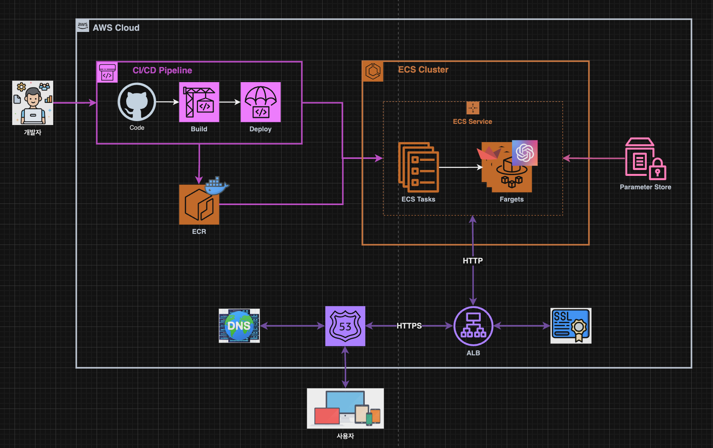
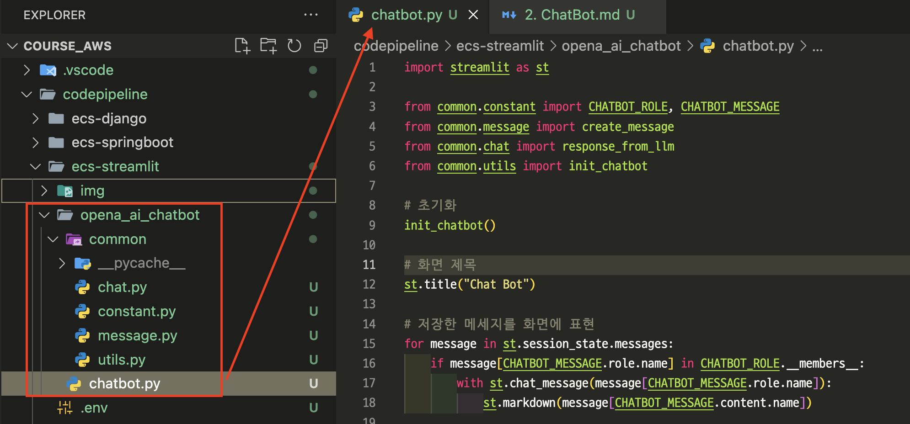
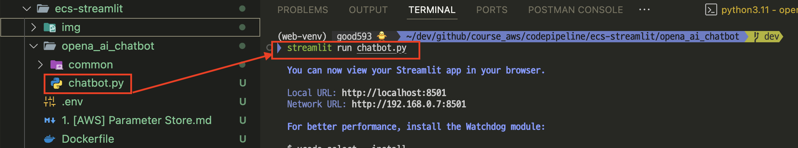
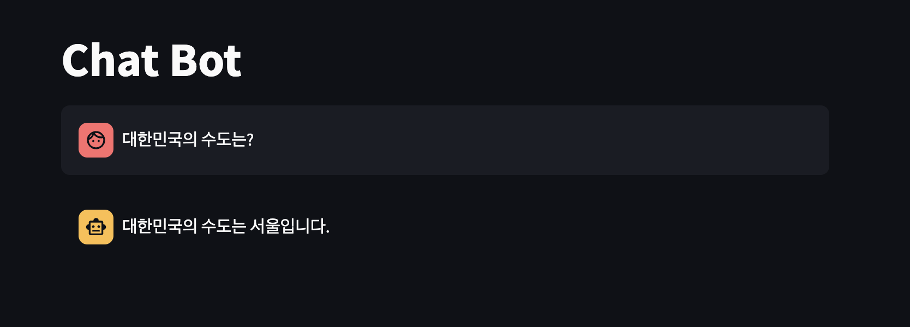
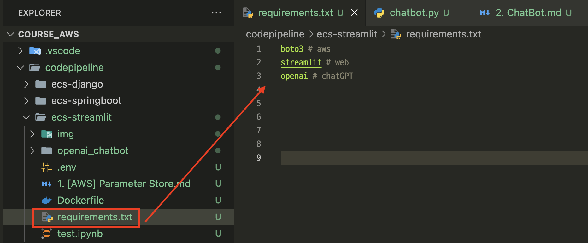
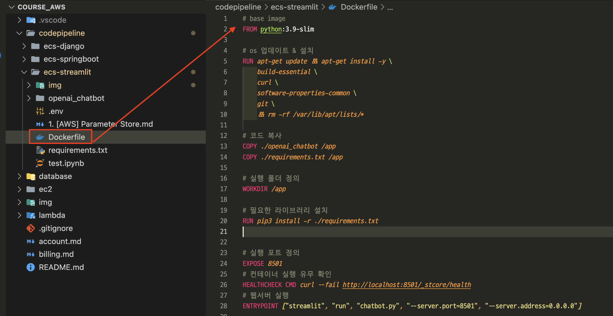
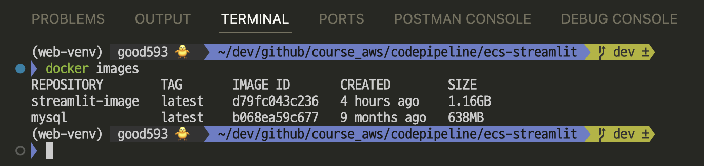
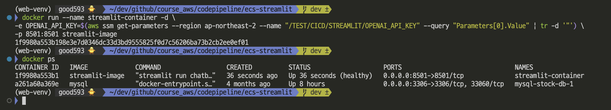
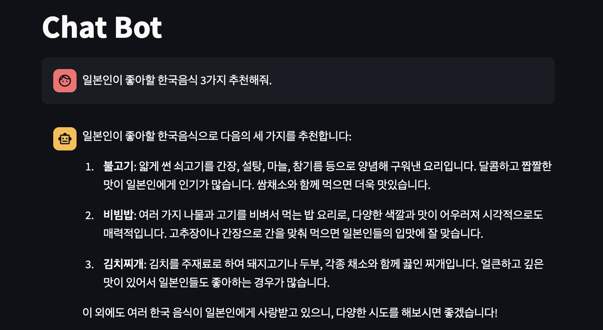
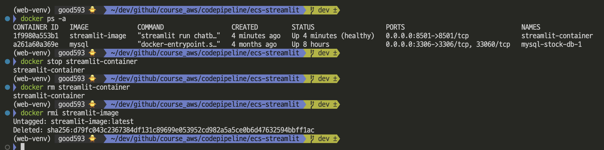

# Architecture


---
# ChatBot Project on streamlit


---
### 단계1: streamlit 실행 
```python
$ cd openai_chatbot # streamlit 폴더로 이동 
$ streamlit run chatbot.py # streamlit 실행 
```


ls를 입력하면 common과 chatbot.py만 있어야 함
정확한 프로젝트의 디렉터리로 지정되어야 한다

---
### 단계2: chatbot 실행 
```shell
Local URL: http://localhost:8501
```


---
# ChatBot Project on docker

---
### 단계1: [requirements.txt](https://www.freecodecamp.org/news/python-requirementstxt-explained/)
- 필요한 라이브러리 설정 
```shell
$ cd ecs-streamlit # 프로젝트 폴더로 이동 
$ vim requirements.txt # 파일 생성 
```


---
### 단계2: [streamlit on docker](https://docs.streamlit.io/deploy/tutorials/docker)


---
### 단계2: Make docker image
- 명령어: `docker build --platform linux/amd64 -t [이미지명] .`
```shell
# Make docker image
$ docker build --platform linux/amd64 -t streamlit-image . (리눅스 or Mac)
$ docker build -t streamlit-image . (윈도우)
$ docker images # 생성된 이미지 확인 
```


---
### 단계3: Run container
- 명령어: `docker run --name [컨테이너명] -d -e [환경변수] -p 8501:8501  [이미지명]`
```shell
$ docker run --name streamlit-container -d \
-e OPENAI_API_KEY=$(aws ssm get-parameters --region ap-northeast-2 --name "/TEST/CICD/STREAMLIT/OPENAI_API_KEY" --query "Parameters[0].Value" | tr -d '"') \
-p 8501:8501 streamlit-image

$ docker ps # 실행중인 컨테이너 확인 
```

윈도우는 아래로 사용해야 함
```shell
$ docker run --name streamlit-container -d -e OPENAI_API_KEY=$(aws ssm get-parameters --region ap-northeast-2 --name "/TEST/CICD/STREAMLIT/OPENAI_API_KEY" --query "Parameters[0].Value" --output text) -p 8501:8501 streamlit-image

```

-d : 백그라운드 설치
-e : 환경변수 키 설정


--query "Parameters[0].Value" 인 이유는 AWS의 parameter store에 리스트 형태로 저장됨



---
### 단계4: 접속 및 실행 
```shell
Local URL: http://localhost:8501
```


---
### 단계5: 참고 
```shell
$ docker stop streamlit-container # 컨테이너 멈춤 
$ docker ps -a # 컨테이너 멈춤 확인 
$ docker rm streamlit-container # 컨테이너 삭제  
$ docker rmi streamlit-image # 이미지 삭제 
```

